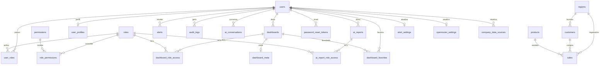

# NeXora — Modelagem e Funcionamento do Banco de Dados

Documento de referência para a parte escrita do TCC.  
Fonte canônica do schema: `database/install_mysql.sql`  
Lista de tabelas obrigatórias: `api/database/required_tables.php`

---

## 1. Visão geral

O **NeXora** é uma plataforma SaaS de Business Intelligence. O banco de dados central armazena:

| Domínio | Função |
|--------|--------|
| Autenticação e usuários | Contas, senhas, perfis |
| Autorização (RBAC) | Papéis, permissões e vínculos |
| Dashboards | Painéis, metadados, favoritos e ACL por papel |
| Alertas | Notificações e configurações de regras |
| Auditoria | Registro de ações no sistema |
| Dados de negócio (demo/BI) | Regiões, produtos, clientes e vendas |
| Inteligência Artificial | Conversas, relatórios gerados por IA e configurações OpenRouter |
| Fontes externas | Conexões a bancos/APIs da empresa contratante |
| Segurança operacional | Tokens de reset de senha e controle de migrations |

**SGBD:** MySQL (Hostinger em produção; acesso remoto no desenvolvimento via WAMP).  
**Engine:** InnoDB (suporte a chaves estrangeiras e transações).  
**Charset:** `utf8mb4`.  
**Acesso na API:** PDO (PHP), com prepared statements e padrão Singleton.

---

## 2. Arquitetura de acesso ao banco

### 2.1 Camadas

```
Frontend (React/Vite)
        │  HTTP/JSON + JWT
        ▼
API PHP (Controllers / Services / Repositories)
        │  PDO
        ▼
MySQL NeXora (schema principal)
        │
        ├── tabelas de sistema (users, roles, dashboards, ai_*, …)
        └── tabelas de negócio BI (regions, products, customers, sales)

Opcionalmente (configurável):
Company Data Sources → banco/API externo da empresa cliente
```

### 2.2 Conexão (Singleton)

1. `api/settings/settings.php` define constantes (`DB_HOST`, `DB_NAME`, `DB_USER`, `DB_PASS`, etc.).
2. `createPDOConnection()` em `api/settings/includes.php` monta o DSN MySQL e cria o `PDO`.
3. `getConexaoDB1()` mantém uma única conexão por requisição.
4. A classe `Shared\Database` (Singleton) encapsula essa conexão e, na primeira obtenção, **valida se todas as tabelas obrigatórias existem**.

Opções PDO usadas:

- `PDO::ERRMODE_EXCEPTION`
- `PDO::FETCH_ASSOC`
- `PDO::EMULATE_PREPARES = false` (prepared statements reais)

### 2.3 Ambientes

| Ambiente | `DB_HOST` típico | Observação |
|----------|------------------|------------|
| Produção (Hostinger) | `localhost` | Site e MySQL no mesmo servidor |
| Desenvolvimento (WAMP/PC) | hostname remoto Hostinger (ex.: `srv….hstgr.io`) | O projeto **não** usa o MySQL local do WAMP por padrão |

Credenciais e segredos ficam em configuração/env — **não devem ser documentados no TCC com valores reais**.

### 2.4 Validação de schema em runtime

O serviço `DatabaseSchemaService` consulta `information_schema.TABLES` e compara com a lista de `required_tables.php`.  
Se faltar tabela, a API falha com mensagem orientando a importar `database/install_mysql.sql`.

---

## 3. Modelo lógico — agrupamento por domínio

### 3.1 Diagrama entidade-relacionamento (visão geral)



### 3.2 Domínios resumidos

1. **Identidade e acesso:** `users`, `user_profiles`, `roles`, `permissions`, `user_roles`, `role_permissions`, `password_reset_tokens`
2. **Dashboards:** `dashboards`, `dashboard_meta`, `dashboard_role_access`, `dashboard_favorites`
3. **Alertas e auditoria:** `alerts`, `alert_settings`, `audit_logs`
4. **Dados de negócio (BI):** `regions`, `products`, `customers`, `sales`
5. **IA:** `ai_conversations`, `ai_reports`, `ai_report_role_access`, `openrouter_settings`
6. **Integração:** `company_data_sources`
7. **Infraestrutura:** `migrations`

---

## 4. Catálogo completo de tabelas

Todas as tabelas usam `ENGINE=InnoDB DEFAULT CHARSET=utf8mb4`, salvo indicação em contrário.

### 4.1 `users` — usuários do sistema

| Coluna | Tipo | Restrições | Descrição |
|--------|------|------------|-----------|
| id | INT | PK, AUTO_INCREMENT | Identificador |
| name | VARCHAR(255) | NOT NULL | Nome exibido |
| email | VARCHAR(255) | NOT NULL, UNIQUE | Login |
| password_hash | VARCHAR(255) | NOT NULL | Hash bcrypt (`password_hash` PHP) |
| status | VARCHAR(50) | NOT NULL, default `active` | Estado da conta |
| created_at | DATETIME | NOT NULL | Criação |
| updated_at | DATETIME | NOT NULL | Última atualização |

**Uso:** autenticação JWT, listagem/CRUD de usuários, vínculo com papéis.

---

### 4.2 `roles` — papéis (RBAC)

| Coluna | Tipo | Restrições | Descrição |
|--------|------|------------|-----------|
| id | INT | PK, AUTO_INCREMENT | |
| name | VARCHAR(100) | NOT NULL, UNIQUE | Código: `admin`, `manager`, `viewer` |
| description | VARCHAR(255) | NULL | Descrição |
| created_at | DATETIME | NOT NULL | |

Papéis padrão (seed `database/scripts/seed_admin.sql`):

| name | Significado |
|------|-------------|
| admin | Acesso total |
| manager | Gerencia usuários e dashboards |
| viewer | Somente leitura |

---

### 4.3 `permissions` — permissões granulares

| Coluna | Tipo | Restrições | Descrição |
|--------|------|------------|-----------|
| id | INT | PK, AUTO_INCREMENT | |
| name | VARCHAR(100) | NOT NULL, UNIQUE | Ex.: `users.read` |
| description | VARCHAR(255) | NULL | |
| created_at | DATETIME | NOT NULL | |

Permissões seedadas:

- `users.read` / `users.write`
- `dashboards.read` / `dashboards.write`
- `alerts.read`
- `audit.read`

Matriz típica:

| Papel | Permissões |
|-------|------------|
| admin | todas |
| manager | users.*, dashboards.*, alerts.read, audit.read |
| viewer | dashboards.read, alerts.read |

---

### 4.4 `user_roles` — N:N usuário ↔ papel

| Coluna | Tipo | Restrições |
|--------|------|------------|
| user_id | INT | PK composta, FK → `users.id` ON DELETE CASCADE |
| role_id | INT | PK composta, FK → `roles.id` ON DELETE CASCADE |
| assigned_at | DATETIME | NOT NULL |

---

### 4.5 `role_permissions` — N:N papel ↔ permissão

| Coluna | Tipo | Restrições |
|--------|------|------------|
| role_id | INT | PK composta, FK → `roles.id` ON DELETE CASCADE |
| permission_id | INT | PK composta, FK → `permissions.id` ON DELETE CASCADE |
| granted_at | DATETIME | NOT NULL |

**Funcionamento:** o `PermissionRepository` verifica se um papel possui determinada permissão via JOIN entre `role_permissions`, `roles` e `permissions`.

---

### 4.6 `user_profiles` — perfil estendido (1:1 com usuário)

| Coluna | Tipo | Restrições |
|--------|------|------------|
| user_id | INT | PK, FK → `users.id` ON DELETE CASCADE |
| first_name | VARCHAR(255) | NULL |
| last_name | VARCHAR(255) | NULL |
| phone | VARCHAR(50) | NULL |
| job_title | VARCHAR(255) | NULL |
| avatar_url | TEXT | NULL |
| updated_at | DATETIME | NOT NULL |

---

### 4.7 `password_reset_tokens` — recuperação de senha

| Coluna | Tipo | Restrições |
|--------|------|------------|
| id | INT | PK, AUTO_INCREMENT |
| user_id | INT | FK → `users.id` ON DELETE CASCADE |
| token_hash | VARCHAR(255) | NOT NULL, UNIQUE (hash do token, não o token em claro) |
| expires_at | DATETIME | NOT NULL |
| created_at | DATETIME | NOT NULL |

Índice: `idx_password_reset_tokens_user_id (user_id)`.

---

### 4.8 `dashboards` — painéis

| Coluna | Tipo | Restrições |
|--------|------|------------|
| id | INT | PK, AUTO_INCREMENT |
| name | VARCHAR(255) | NOT NULL |
| description | TEXT | NULL |
| owner_id | INT | FK → `users.id` ON DELETE CASCADE |
| is_public | TINYINT(1) | NOT NULL, default 0 |
| created_at / updated_at | DATETIME | NOT NULL |

---

### 4.9 `dashboard_meta` — metadados do dashboard (1:1)

| Coluna | Tipo | Restrições |
|--------|------|------------|
| dashboard_id | INT | PK, FK → `dashboards.id` ON DELETE CASCADE |
| embed_url | TEXT | NULL (URL de embed, ex. Power BI / Looker) |
| category | VARCHAR(50) | NOT NULL, default `other` |
| views_count | INT | NOT NULL, default 0 |
| updated_at | DATETIME | NOT NULL |

---

### 4.10 `dashboard_role_access` — ACL por papel

| Coluna | Tipo | Restrições |
|--------|------|------------|
| dashboard_id | INT | PK composta, FK → `dashboards` CASCADE |
| role_id | INT | PK composta, FK → `roles` CASCADE |
| granted_at | DATETIME | NOT NULL |

Um dashboard pode ser público (`is_public = 1`) ou restrito a papéis listados nesta tabela.

---

### 4.11 `dashboard_favorites` — favoritos do usuário

| Coluna | Tipo | Restrições |
|--------|------|------------|
| user_id | INT | PK composta, FK → `users` CASCADE |
| dashboard_id | INT | PK composta, FK → `dashboards` CASCADE |
| favorited_at | DATETIME | NOT NULL |

Índice: `idx_dashboard_favorites_user_favorited_at (user_id, favorited_at DESC)`.

---

### 4.12 `alerts` — alertas in-app

| Coluna | Tipo | Restrições |
|--------|------|------------|
| id | INT | PK, AUTO_INCREMENT |
| user_id | INT | FK → `users` CASCADE |
| title | VARCHAR(255) | NOT NULL |
| message | TEXT | NOT NULL |
| level | VARCHAR(50) | NOT NULL, default `info` |
| is_read | TINYINT(1) | NOT NULL, default 0 |
| created_at | DATETIME | NOT NULL |

---

### 4.13 `alert_settings` — configuração global de regras (singleton lógico)

| Coluna | Tipo | Descrição |
|--------|------|-----------|
| id | TINYINT UNSIGNED PK | Sempre `1` (registro único) |
| notify_email / notify_in_app | TINYINT(1) | Canais de notificação |
| sales_drop_enabled / sales_drop_percent | regra de queda de vendas |
| stock_low_enabled / stock_low_qty | estoque baixo |
| inactive_customers_enabled / inactive_days | clientes inativos |
| finance_goal_enabled / finance_goal_percent | meta financeira |
| updated_at | DATETIME | |
| updated_by | INT NULL | FK → `users` ON DELETE SET NULL |

Seed: `INSERT IGNORE` do registro `id = 1`.

---

### 4.14 `audit_logs` — trilha de auditoria

| Coluna | Tipo | Restrições |
|--------|------|------------|
| id | INT | PK, AUTO_INCREMENT |
| user_id | INT NULL | FK → `users` ON DELETE SET NULL |
| action | VARCHAR(100) | NOT NULL |
| entity | VARCHAR(100) | NOT NULL |
| entity_id | VARCHAR(100) | NULL |
| metadata | TEXT | NULL (JSON ou texto complementar) |
| created_at | DATETIME | NOT NULL |

Usado em analytics administrativos (contagens do dia / últimos N dias).

---

### 4.15 `migrations` — controle de scripts aplicados

| Coluna | Tipo | Restrições |
|--------|------|------------|
| id | INT | PK, AUTO_INCREMENT |
| filename | VARCHAR(255) | NOT NULL, UNIQUE |
| applied_at | DATETIME | NOT NULL |

---

### 4.16 Modelo de negócio (dados para BI / relatórios IA)

Estas quatro tabelas formam o **schema de negócio** que a IA pode consultar (somente `SELECT`), descrito em `BusinessSchemaService`.

#### `regions`

| Coluna | Tipo |
|--------|------|
| id | INT PK AI |
| name | VARCHAR(255) UNIQUE |
| code | VARCHAR(50) UNIQUE |
| created_at | DATETIME |

#### `products`

| Coluna | Tipo |
|--------|------|
| id | INT PK AI |
| name | VARCHAR(255) |
| category | VARCHAR(100), default `other` |
| unit_price | DECIMAL(12,2) |
| created_at | DATETIME |

Categorias típicas: `commercial`, `marketing`, `finance`, `hr`, `operations`, `other`.

#### `customers`

| Coluna | Tipo |
|--------|------|
| id | INT PK AI |
| name | VARCHAR(255) |
| segment | VARCHAR(100), default `geral` |
| region_id | INT FK → `regions.id` ON DELETE **RESTRICT** |
| created_at | DATETIME |

Segmentos típicos: `geral`, `enterprise`, `pme`.

#### `sales`

| Coluna | Tipo |
|--------|------|
| id | INT PK AI |
| sale_date | DATE |
| customer_id | INT FK → `customers` RESTRICT |
| product_id | INT FK → `products` RESTRICT |
| region_id | INT FK → `regions` RESTRICT |
| quantity | INT, default 1 |
| unit_price | DECIMAL(12,2) |
| total_amount | DECIMAL(12,2) |
| seller_name | VARCHAR(255) |
| created_at | DATETIME |

Índices de performance:

- `idx_sales_sale_date`
- `idx_sales_region_id`
- `idx_sales_product_id`
- `idx_customers_region_id`

**Relacionamentos de negócio:**

```
regions 1 ── N customers
regions 1 ── N sales
customers 1 ── N sales
products 1 ── N sales
```

`ON DELETE RESTRICT` impede apagar região/cliente/produto ainda referenciado por vendas, preservando integridade analítica.

---

### 4.17 `ai_conversations` — histórico do assistente

| Coluna | Tipo | Restrições |
|--------|------|------------|
| id | INT | PK AI |
| user_id | INT | FK → `users` CASCADE |
| title | VARCHAR(255) | default `''` |
| messages_json | LONGTEXT | NOT NULL (histórico serializado em JSON) |
| created_at / updated_at | DATETIME | |

Índice: `idx_ai_conversations_user_updated (user_id, updated_at)`.

---

### 4.18 `ai_reports` — relatórios gerados por IA

| Coluna | Tipo | Descrição |
|--------|------|-----------|
| id | INT PK AI | |
| owner_id | INT FK → users CASCADE | Dono |
| title | VARCHAR(255) | Título |
| description | TEXT | |
| category | VARCHAR(100) | default `commercial` |
| chart_type | VARCHAR(50) | default `bar` |
| sql_query | LONGTEXT | SQL SELECT gerado/validado |
| x_key / y_key | VARCHAR(100) | Eixos do gráfico |
| definition_json | LONGTEXT | Definição estruturada do relatório |
| prompt_summary | TEXT | Resumo do prompt do usuário |
| is_public | TINYINT(1) | Visibilidade |
| views_count | INT | Contador de visualizações |
| created_at / updated_at | DATETIME | |

Índice: `idx_ai_reports_owner_id`.

#### `ai_report_role_access` — ACL de relatórios IA

Mesmo padrão de `dashboard_role_access`: `(report_id, role_id)` com CASCADE.

---

### 4.19 `openrouter_settings` — configuração da API de IA (singleton)

| Coluna | Tipo | Descrição |
|--------|------|-----------|
| id | TINYINT UNSIGNED PK | Sempre `1` |
| api_key | VARCHAR(512) | Chave OpenRouter (configurada pela UI) |
| default_model | VARCHAR(128) | Modelo padrão |
| updated_at | DATETIME | |
| updated_by | INT NULL | FK → users SET NULL |

---

### 4.20 `company_data_sources` — fontes de dados da empresa cliente

Permite cadastrar conexões externas (banco ou API) usadas pela empresa contratante.

| Grupo | Campos principais |
|-------|-------------------|
| Identidade | `name`, `connection_type` (`database` \| `api`), `is_active`, `is_default` |
| Banco | `db_driver` (mysql/pgsql/sqlsrv), host, port, name, user, password, ssl, charset |
| API | `api_base_url`, `api_auth_type` (none/bearer/api_key/basic), token, header, user/pass, test path |
| Diagnóstico | `last_tested_at`, `last_test_ok`, `last_test_message` |
| Auditoria | `created_at`, `updated_at`, `updated_by` → users SET NULL |

Índice: `idx_company_data_sources_default (is_default, is_active)`.

**Segurança:** senhas/tokens sensíveis podem ser armazenados cifrados com `SecretCipher` (AES-256-CBC, prefixo `enc:v1:`), usando chave derivada do segredo da aplicação.

> Observação: a tabela existe no `install_mysql.sql` e na migration `database/migrations/add_company_data_sources.sql`. A lista `required_tables.php` atual **não** a inclui como obrigatória no boot — a criação também pode ser garantida em runtime pelo repositório (`ensureSchema`).

---

## 5. Integridade referencial e regras de exclusão

| Política | Onde | Efeito |
|----------|------|--------|
| `ON DELETE CASCADE` | vínculos de usuário, dashboards, AI, papéis | Ao remover o pai, remove filhos dependentes |
| `ON DELETE SET NULL` | `audit_logs.user_id`, `*_settings.updated_by`, etc. | Mantém o registro histórico sem usuário |
| `ON DELETE RESTRICT` | vendas ↔ clientes/produtos/regiões | Impede exclusão que quebraria o histórico BI |

Chaves compostas (PKs N:N) evitam duplicidade de vínculos.

---

## 6. Funcionamento na aplicação

### 6.1 Padrão Repository

A API acessa o banco principalmente via repositórios em `api/app/Repositories/`:

| Repositório | Tabelas principais |
|-------------|-------------------|
| UserRepository | users, user_roles |
| UserProfileRepository | user_profiles, users |
| PermissionRepository | role_permissions, roles, permissions |
| DashboardRepository | dashboards, dashboard_meta, dashboard_role_access |
| DashboardFavoriteRepository | dashboard_favorites |
| AiConversationRepository | ai_conversations |
| AiReportRepository | ai_reports, ai_report_role_access |
| AlertSettingsRepository | alert_settings |
| OpenRouterSettingsRepository | openrouter_settings |
| CompanyDataSourceRepository | company_data_sources |
| PasswordResetRepository | password_reset_tokens |

Controllers orquestram HTTP; Services aplicam regras de negócio; Repositories isolam SQL.

### 6.2 Fluxo de autenticação e autorização

1. Login consulta `users` (email + verificação de `password_hash`).
2. Papéis vêm de `user_roles` + `roles`.
3. Endpoints protegidos usam JWT + verificação de permissão (`PermissionRepository`).
4. Dashboards/relatórios IA respeitam `is_public` e tabelas `*_role_access`.

### 6.3 Geração de relatórios por IA (uso seguro do SQL)

1. `BusinessSchemaService` descreve apenas `regions`, `products`, `customers`, `sales`.
2. O modelo de IA propõe um `SELECT`.
3. `SqlValidator` garante:
   - somente `SELECT`
   - sem `;` (uma instrução)
   - bloqueio de `INSERT/UPDATE/DELETE/DROP/...`
   - tabelas apenas da lista permitida
   - `LIMIT` automático (padrão até 500 linhas)
4. O resultado é persistido em `ai_reports` (SQL + metadados de gráfico).

Isso separa claramente:

- **banco de sistema** (controle da plataforma)
- **banco de negócio consultável pela IA** (fatos e dimensões de vendas)

### 6.4 Fontes externas (`company_data_sources`)

Além do schema NeXora, o administrador pode cadastrar conexões da empresa cliente (MySQL/PostgreSQL/SQL Server ou API HTTP). A API valida, testa conectividade e guarda o status do último teste.

---

## 7. Instalação e evolução do schema

### 7.1 Instalação completa

Arquivo: `database/install_mysql.sql`

1. Importar no phpMyAdmin (ou cliente MySQL) no banco configurado.
2. (Opcional) Executar seed: `database/scripts/seed_admin.sql`  
   - Cria papéis, permissões, matriz RBAC e usuário admin inicial.
3. A API valida automaticamente as tabelas obrigatórias na conexão.

Há um bloco comentado de `DROP TABLE` (ordem correta respeitando FKs) para reinstalação do zero.

### 7.2 Migrations incrementais

Pasta: `database/migrations/`

| Arquivo | Objetivo |
|---------|----------|
| `add_openrouter_settings.sql` | Tabela de configuração OpenRouter |
| `add_company_data_sources.sql` | Fontes de dados da empresa |

Scripts PHP em `api/tests/apply_*_migration.php` aplicam esses SQL em ambientes já existentes.

### 7.3 Tabelas obrigatórias no boot

Definidas em `api/database/required_tables.php` (espelho do install, com exceção de algumas tabelas opcionais/auto-criadas como `company_data_sources` / `alert_settings` em certos fluxos). Manter sincronizado ao alterar o schema.

---

## 8. Índices e desempenho

Além das PKs/UNIQUEs, o projeto define índices para consultas frequentes:

| Índice | Tabela | Motivo |
|--------|--------|--------|
| email UNIQUE | users | Login rápido |
| idx_sales_sale_date | sales | Filtros temporais BI |
| idx_sales_region_id / idx_sales_product_id | sales | Agregações |
| idx_customers_region_id | customers | JOIN por região |
| idx_ai_conversations_user_updated | ai_conversations | Listagem recente por usuário |
| idx_dashboard_favorites_user_favorited_at | dashboard_favorites | Favoritos ordenados |
| idx_ai_reports_owner_id | ai_reports | Relatórios do dono |
| idx_company_data_sources_default | company_data_sources | Fonte padrão ativa |

Tipos monetários usam `DECIMAL(12,2)` (precisão financeira, evitando float).

---

## 9. Aspectos de segurança relevantes para o TCC

1. **Senhas:** armazenadas apenas como hash (bcrypt), nunca em texto puro.
2. **Tokens de reset:** salvos como hash; com expiração (`expires_at`).
3. **SQL Injection:** prepared statements PDO; validação estrita de SQL gerado por IA.
4. **Princípio do menor privilégio na IA:** somente tabelas de negócio e somente `SELECT`.
5. **Credenciais de fontes externas:** cifradas em disco (`SecretCipher` / AES-256-CBC).
6. **Auditoria:** ações relevantes podem ser registradas em `audit_logs`.
7. **CASCADE vs RESTRICT:** proteção do histórico de vendas versus limpeza automática de dados do usuário.

---

## 10. Texto-base sugerido para o TCC (pode adaptar)

> O banco de dados do NeXora foi modelado em MySQL com engine InnoDB e charset utf8mb4, priorizando integridade referencial e suporte a transações. O modelo relacional organiza-se em domínios: identidade e controle de acesso baseado em papéis (RBAC), gestão de dashboards e favoritos, alertas e auditoria, dados dimensionais de negócio para análise (regiões, produtos, clientes e vendas), recursos de inteligência artificial (conversas, relatórios e configurações de provedor) e cadastro de fontes de dados externas da empresa contratante.
>
> A aplicação acessa o SGBD por meio de PDO, utilizando o padrão Singleton para reutilizar a conexão por requisição e validando, em tempo de execução, a presença das tabelas obrigatórias. A autorização combina tabelas de papéis e permissões com listas de acesso (ACL) específicas para dashboards e relatórios. Já as consultas analíticas geradas por inteligência artificial são restritas, via validação de SQL, às tabelas de negócio e a instruções SELECT, com limite de linhas, reduzindo riscos de alteração indevida dos dados.
>
> A evolução do schema é versionada por script de instalação completa (`install_mysql.sql`) e migrations incrementais, permitindo implantação inicial e atualizações controladas em ambientes já existentes.

---

## 11. Arquivos do projeto para consultar

| Arquivo | Conteúdo |
|---------|----------|
| `database/install_mysql.sql` | DDL completo (fonte da verdade) |
| `database/scripts/seed_admin.sql` | Papéis, permissões e admin |
| `database/migrations/*.sql` | Evoluções incrementais |
| `api/database/required_tables.php` | Checklist de tabelas obrigatórias |
| `api/shared/Database.php` | Singleton PDO + validação de schema |
| `api/settings/settings.php` / `includes.php` | Configuração e criação da conexão |
| `api/app/Services/BusinessSchemaService.php` | Schema de negócio exposto à IA |
| `api/app/Services/SqlValidator.php` | Guardrails de SELECT |
| `api/app/Services/DatabaseSchemaService.php` | Validação via information_schema |
| `api/app/Repositories/*` | Operações CRUD por domínio |
| `api/app/Support/RoleCatalog.php` | Catálogo de papéis da aplicação |
| `api/app/Support/SecretCipher.php` | Criptografia de segredos |

---

## 12. Checklist rápido para quem for escrever a seção no TCC

- [ ] Citar SGBD MySQL + InnoDB + utf8mb4  
- [ ] Explicar arquitetura em camadas (API → PDO → MySQL)  
- [ ] Descrever RBAC (`users`–`roles`–`permissions`)  
- [ ] Descrever modelo dimensional de vendas (fato `sales` + dimensões)  
- [ ] Incluir diagrama ER (Mermaid acima ou redesenhar no Draw.io/BRModelo)  
- [ ] Explicar CASCADE / RESTRICT / SET NULL  
- [ ] Mencionar índices e DECIMAL para valores monetários  
- [ ] Explicar segurança: hash de senha, SQL seguro da IA, cifração de credenciais  
- [ ] Citar instalação via `install_mysql.sql` e migrations  
- [ ] Diferenciar banco da plataforma vs. fontes externas (`company_data_sources`)  

---

*Documento gerado a partir do código do repositório NeXora. Atualize este arquivo se o schema SQL mudar.*
